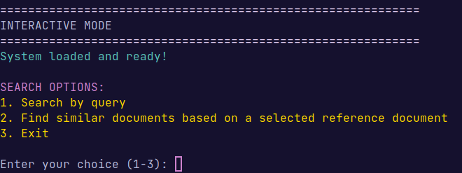

## 📋 Índice

- [Visão Geral](#-visão-geral)
- [Instalação](#-instalação)
- [Estrutura do Projeto](#-estrutura-do-projeto)
- [Utilização](#-utilização)
- [Componentes Técnicos](#-componentes-técnicos)
  - [Extração de Dados](#-extração-de-dados-data_extractionpy)
  - [Processamento de Dados](#-processamento-de-dados-data_processingpy)
  - [Cálculo de Similaridades](#-cálculo-de-similaridades-similarity_calculatorpy)
  - [Processamento de Queries](#-processamento-de-queries-query_processorpy)
  - [Treino de Modelos](#-treino-de-modelos-model_trainerpy)
  - [Sistema de Cache](#-sistema-de-cache-caching_systempy)
  - [Sistema de Retrieval](#-sistema-de-retrieval-retrieval_systempy)
  - [Validação de Dados](#️-validação-de-dados-data_validatorpy)
- [Configuração](#️-configuração)
- [Frontend Web Application](#-frontend-web-application)
- [Contribuidores](#-contribuidores)

## 🎯 Visão Geral

Este sistema implementa uma solução completa de Information Retrieval para o RepositoriUM através de:

- **Embeddings Semânticos**: Utiliza sentence transformers fine-tuned para capturar significado profundo dos documentos
- **Clustering Inteligente**: Reduz complexidade computacional através de agrupamento adaptativo de documentos
- **Cache Híbrido**: Sistema de cache em memória e disco para máxima performance
- **Query Processing**: Normalização e enhancement automático de queries de pesquisa
- **Similarity Multi-dimensional**: Combina TF-IDF, metadados e embeddings neurais de forma a obter melhores resultados

## 🚀 Instalação

### Instalação das Dependências

```bash
# Clona o repositório
git clone https://github.com/JoaoCoelho2003/IRUM-SPLN
cd IRUM-SPLN

# Instala dependências
pip install -r requirements.txt

# Download de recursos NLTK necessários
python -c "
import nltk
nltk.download('punkt')
nltk.download('stopwords')
nltk.download('wordnet')
"
```

## 📂 Estrutura do Projeto

```
IRUM-SPLN/
├── README.md                  # Documentação principal
├── public/                    # Recursos públicos (imagens, scripts)
├── backend/                   # Componentes do sistema backend
│   ├── main.py                # Pipeline principal e orquestração
│   ├── config.py              # Configurações globais do sistema
│   ├── utils.py               # Utilitários partilhados entre componentes
│   ├── data_extraction.py     # Extração de dados via OAI-PMH
│   ├── data_processing.py     # Processamento XML→JSON
│   ├── data_validator.py      # Validação e limpeza de dados
│   ├── similarity_calculator.py # Cálculo de similaridades com clustering
│   ├── model_trainer.py       # Fine-tuning de sentence transformers
│   ├── query_processor.py     # Processamento e enhancement de queries
│   ├── retrieval_system.py    # Motor de pesquisa semântica
│   ├── caching_system.py      # Sistema de cache híbrido
│   ├── evaluation_system.py   # Avaliação e métricas de performance
│   ├── cache/                 # Armazenamento de embeddings em cache
│   ├── data/                  # Dados processados e estruturados
│   └── models/                # Modelos treinados e checkpoints
├── frontend/                  # Componentes do sistema frontend
```

## 🎮 Utilização

### Execução Completa do Sistema

Para executar o sistema completo, siga os passos abaixo:

#### 1. Iniciar o Backend

Execute o backend utilizando o seguinte comando:

```bash
python3 app.py
```

#### 2. Iniciar o Frontend

Instale as dependências do frontend e inicie o servidor de desenvolvimento:

```bash
npm install
npm run dev
```

De seguida, aceda à aplicação web através do endereço fornecido no terminal.

### Modo Alternativo: Apenas Backend em Terminal

Caso não deseje utilizar a aplicação web, pode executar o backend diretamente em modo terminal. Este modo inclui todas as funcionalidades do pipeline e permite realizar pesquisas interativas diretamente no terminal.

```bash
python3 main.py
```

No modo interativo, o utilizador pode realizar pesquisas em tempo real, com queries processadas e resultados ordenados por relevância. Além disso, o sistema oferece duas funcionalidades principais: procurar documentos similares a uma query ou explorar os documentos disponíveis e selecionar um para encontrar os similares.



#### Execução de Componentes Individuais

Cada componente do sistema pode ser executado independentemente para desenvolvimento, debugging ou análise específica de uma fase do pipeline.

```bash
python3 <nome_ficheiro>.py
```

## 🧠 Componentes Técnicos

### 📥 **Extração de Dados (data_extraction.py)**

O script extrai documentos do RepositoriUM recorrendo ao protocolo OAI-PMH.

#### **Estratégias de Robustez:**

- **Retry com Backoff Exponencial**: Sistema de retry com até 3 tentativas e delays crescentes exponencialmente com jitter aleatório para evitar thundering herd
- **Timeout Configurável**: Timeout de 45 segundos por request por defeito, ajustável conforme latência da rede e tamanho dos dados
- **Gestão de Erros Consecutivos**: Para automaticamente após 5 erros consecutivos para evitar loops infinitos e proteger o servidor remoto

#### **Suporte Multi-Coleção:**

O sistema suporta extração simultânea de múltiplas coleções do RepositoriUM, incluindo Mestrados em Informática, outros Mestrados e Doutoramentos (para adicionar/remover coleções é necessário editar `config.py`).

#### **Otimizações de Performance:**

- **Extração por Lotes**: Utiliza resumption tokens do protocolo OAI-PMH para processar grandes volumes de dados eficientemente
- **Monitorização em Tempo Real**: Estatísticas detalhadas são apresentadas durante a extração para acompanhamento do progresso

### 🔧 **Processamento de Dados (data_processing.py)**

Converte dados XML para formato JSON estruturado através de um pipeline de limpeza multi-fase que garante qualidade e consistência dos dados.

#### **Pipeline de Limpeza:**

O sistema implementa um pipeline de limpeza em três fases principais:

1. **Remoção de Caracteres de Controlo**: Elimina caracteres não imprimíveis que podem corromper o processamento posterior, utilizando categorização Unicode para identificar caracteres problemáticos.

2. **Normalização de Espaços**: Converte múltiplos espaços, tabs e quebras de linha em espaços únicos através de expressões regulares.

3. **Normalização de Datas**: Extrai anos no formato YYYY através de expressões regulares para garantir consistência temporal nos metadados.

#### **Validação de Qualidade Rigorosa:**

- **Abstracts**: Validação de tamanho mínimo (50 caracteres) e máximo (2000 caracteres) para evitar ruído (estes valores podem ser alterados em `config.py`)
- **Títulos**: Verificação de obrigatoriedade e não-vazio para garantir metadados essenciais
- **Metadados**: Validação de estrutura e tipos de dados para consistência

#### **Estruturação JSON:**

O sistema produz documentos JSON estruturados com campos normalizados incluindo identificador único, título limpo, abstract processado, lista de autores, keywords extraídas, data normalizada, classificações UDC, FoS, etc.

```json
{
  "id": "oai:repositorium.sdum.uminho.pt:1822/81336",
  "uri": "https://hdl.handle.net/1822/81336",
  "title": "Plataforma de agendamento em ambiente hospitalar",
  "abstract": "Desde a sua génese, os Sistemas de Informação Hospitalar (SIH) tem proporcionado um conjunto de métodos (...) e da introdução de novas funcionalidades.",
  "authors": ["Chaves, António Jorge Monteiro"],
  "keywords": [
    "Agendamento",
    "Desenvolvimento Full Stack",
    "Interoperabilidade",
    "Engenharia e Tecnologia::Engenharia Eletrotécnica, Eletrónica e Informática"
  ],
  "date": "2021",
  "type": "info:eu-repo/semantics/masterThesis",
  "language": "por",
  "subjects_udc": [],
  "subjects_fos": [
    "Engenharia e Tecnologia::Engenharia Eletrotécnica, Eletrónica e Informática"
  ],
  "grade": "18 valores",
  "collections": []
}
```

É importante referir que o ficheiro JSON completo nada mais é do que um array de objetos (Documentos), onde cada objeto segue a estrutura apresentada acima.

### 🧮 **Cálculo de Similaridades (similarity_calculator.py)**

O sistema implementa uma abordagem híbrida para calcular similaridades entre documentos, combinando técnicas de clustering, TF-IDF e múltiplas dimensões de similaridade. Este processo é essencial para gerar dados de treino de alta qualidade e otimizar o desempenho do modelo de recuperação semântica.

#### **1. Estratégia de Clustering Adaptativo**

Para coleções grandes (mais de 1000 documentos), calcular similaridades entre todos os pares de documentos seria computacionalmente inviável devido à complexidade de O(n²). Para resolver este problema, o sistema utiliza clustering adaptativo para agrupar documentos em clusters menores, reduzindo a complexidade para O(n log n) e permitindo uma análise mais eficiente.

**Como Funciona**

- **MiniBatch K-Means:**:
  - É utilizado o algoritmo MiniBatch K-Means, que é uma variante eficiente do K-Means, projetada para lidar com grandes volumes de dados.
  - Os documentos são representados como vetores TF-IDF, que capturam a relevância semântica de termos nos textos.
  - O número de clusters (`n_clusters`) é configurado dinamicamente com base no tamanho da coleção, de forma a garantir que cada cluster tem um número razoável de documentos.
  - O algoritmo processa os documentos em lotes de 1000, o que reduz o uso de memória e acelera o cálculo.
- **Exemplo:**
  - Para uma coleção de 10.000 documentos, o sistema pode dividir os mesmos em 50 clusters, com aproximadamente 200 documentos por cluster.
- **Seed Fixa:**
  - É utilizada uma seed fixa (`random_state=2025`) para garantir que os resultados sejam reprodutíveis em diferentes execuções.

**Vantagens do Clustering:**

- **Eficiência Computacional**: Reduz drasticamente o número de cálculos necessários para encontrar similaridades entre documentos.
- **Qualidade dos Pairs**: Documentos dentro do mesmo cluster têm maior probabilidade de serem semanticamente similares.
- **Diversidade**: Pairs entre clusters diferentes fornecem exemplos negativos valiosos para treino
- **Escalabilidade**: Funciona eficientemente com dezenas de milhares de documentos

#### **2. Estratégia de Sampling Inteligente**

Após o clustering, o sistema cria pares de documentos para treinar o modelo de similaridade. Esses pares são divididos em:

- **Pairs intra-cluster:** Documentos dentro do mesmo cluster, que têm alta probabilidade de serem similares.
- **Pairs inter-cluster:** Documentos de clusters diferentes, que têm baixa probabilidade de serem similares.

**Como Funciona**

- **Pairs Intra-Cluster:**
  - Para cada cluster, o sistema seleciona até 100 pares de documentos aleatórios.
  - A similaridade entre os documentos é calculada utilizando similaridade coseno (baseada nos vetores TF-IDF).
  - Apenas pares com similaridade acima de um threshold (0.3) são mantidos, garantindo que os pares sejam semanticamente relevantes.
- **Exemplo:**
  - No cluster A, com 200 documentos, o sistema seleciona 100 pares aleatórios e calcula a similaridade entre eles. Apenas os pares com similaridade acima de 0.3 são usados.
- **Pairs Inter-Cluster:**
  - Para enriquecer os dados de treino com exemplos negativos, o sistema seleciona pares de documentos de clusters diferentes.
  - A similaridade entre os documentos é calculada da mesma forma, mas esses pares geralmente têm baixa similaridade.
- **Exemplo:**
  - O sistema seleciona um documento do cluster A e outro do cluster B, calcula a similaridade e adiciona o par aos dados de treino.

#### **3. TF-IDF Híper-Otimizado**

É utilizado TF-IDF (Term Frequency-Inverse Document Frequency) para representar os documentos como vetores numéricos. Esses vetores capturam a relevância semântica de termos nos textos, permitindo calcular similaridades entre documentos.

**Configuração:**

- **max_features=5000**: Vocabulário limitado aos 5000 termos mais informativos para equilibrar informação vs. eficiência
- **ngram_range=(1,2)**: Inclui unigramas (palavras únicas) e bigramas (duas palavras consecutivas) para capturar contexto e expressões.
- **min_df=2**: Termos devem aparecer em pelo menos 2 documentos para eliminar typos e termos únicos
- **max_df=0.8**: Remove termos que aparecem em mais de 80% dos documentos, como palavras muito comuns.

**Como Funciona**

- Cada documento é transformado num vetor TF-IDF.
- A similaridade entre dois documentos é calculada recorrendo à **similaridade coseno**, que mede o ângulo entre os vetores.

#### **4. Similaridade Multi-Dimensional**

O sistema combina múltiplos sinais de similaridade para capturar diferentes aspectos da relevância semântica.

**Componentes da Similaridade:**

- **Similaridade de Assuntos UDC/FoS:**
  - Utiliza o índice de Jaccard para medir a similaridade entre conjuntos de classificações UDC (Universal Decimal Classification) e FoS (Fields of Science).
  - Contribui com 30% do peso total.
- **Similaridade de Keywords:**
  - Utiliza o índice de Jaccard para medir a similaridade entre conjuntos de keywords extraídas dos documentos.
  - Contribui com 20% do peso total.
- **TF-IDF Base:**
  - Utiliza similaridade coseno para medir a similaridade entre os vetores TF-IDF dos documentos.
  - Contribui com 70% do peso total.

**Combinação**

A similaridade final é calculada como uma combinação ponderada dos três componentes:

```python
final_similarity = tfidf_similarity * 0.7 + subject_similarity * 0.3 + keyword_similarity * 0.2
```

**Justificação da Ponderação:**

- A similaridade TF-IDF domina (70%) porque captura a semântica profunda dos textos.
- Os metadados (UDC/FoS e keywords) refinam e ajustam a similaridade, de forma a garantir que aspectos estruturais e classificações formais são considerados.

### 🧩 **Processamento de Queries (query_processor.py)**

Sistema que normaliza e otimiza queries para maximizar a qualidade dos resultados de pesquisa através de um pipeline de processamento completo.

#### **Pipeline de Processamento:**

1. **Limpeza de Texto**: Remove caracteres de controlo e normaliza espaços múltiplos utilizando as mesmas funções do processamento de documentos para garantir consistência.

2. **Tokenização Inteligente**: Utiliza o tokenizador NLTK punkt que lida corretamente com pontuação, contrações e casos especiais da língua portuguesa e inglesa.

3. **Remoção de Stop Words Multi-idioma**: Sistema adaptativo que tenta português primeiro e faz fallback para inglês, garantindo robustez em ambientes multilíngues.

4. **Extração de Keywords Filtrada**: Filtra tokens alfabéticos com mais de 2 caracteres, excluindo stop words para manter apenas termos semanticamente relevantes.

#### **Classificação Automática de Queries:**

Existe uma classificação automática das queries em categorias (empty, single_term, short_phrase, long_phrase) para permitir estratégias de pesquisa adaptadas ao tipo de query.

#### **Estratégias de Enhancement:**

Implementa duplicação estratégica de keywords para reforço semântico, o que permite aumentar o peso TF-IDF dos termos importantes sem alterar a semântica fundamental da query.

#### **Consistência com Documentos:**

O processamento de queries utiliza exactamente as mesmas funções (clean_text, extract_keywords) que o processamento de documentos, garantindo consistência perfeita na representação textual entre queries e documentos.

### 🤖 **Treino de Modelos (model_trainer.py)**

Implementa fine-tuning de sentence transformers com múltiplas otimizações para eficiência e qualidade, recorrendo a técnicas de machine learning modernas.

Os dados de treino utilizados neste componente são gerados através da **Estratégia de Sampling Inteligente**, detalhada na seção [Cálculo de Similaridades](#2-estratégia-de-sampling-inteligente). Essa abordagem garante que os pares de documentos utilizados no treino sejam semanticamente relevantes e diversificados.

#### **Modelo Base Estrategicamente Escolhido:**

Utiliza o modelo "sentence-transformers/all-MiniLM-L6-v2" que oferece o melhor compromisso entre tamanho (23M parâmetros), velocidade (5x mais rápido que modelos maiores), qualidade (mantém 95% da performance) e suporte multilíngue nativo.

#### **Estratégias de Treino:**

**1. Early Stopping:**
Implementa early stopping com paciência de 2 épocas, guardando checkpoints do melhor modelo e restaurando automaticamente quando a performance de validação para de melhorar.

**2. Split Automático de Dados:**
Quando não são fornecidos dados de validação, o sistema automaticamente reserva 10% dos dados de treino para validação, garantindo avaliação robusta.

**3. Configuração Adaptativa:**
DataLoader configurado com batch size otimizado para GPUs modernas (32), paralelização condicional baseada na disponibilidade de GPU e memory pinning para otimização de transferência de dados.

#### **Loss Function Especializada:**

Utiliza CosineSimilarityLoss que optimiza directamente a métrica usada no retrieval, oferece maior estabilidade que MSE e produz scores directamente interpretáveis como similaridade.

#### **Avaliação Rápida Durante Treino:**

Sistema de avaliação que utiliza apenas 200 exemplos para velocidade, processamento em batches para eficiência, embeddings vectorizados e correlação de Pearson como métrica de qualidade.

### 🚀 **Sistema de Cache (caching_system.py)**

Implementação de cache híbrido que combina memória RAM e armazenamento persistente para máxima performance e eficiência.

#### **Arquitectura do Cache Híbrido:**

**1. Memory Cache (Tier 1 - RAM):**
Cache em memória com acesso O(1), zero I/O e substituição LRU implícita quando atinge o limite configurável de 1000 embeddings.

**2. Disk Cache (Tier 2 - SSD/HDD):**
Cache persistente que sobrevive a reinicializações, com capacidade ilimitada (limitada apenas pelo espaço em disco) e compressão automática via pickle.

#### **Sistema de Chaves Inteligente:**

Utiliza hash MD5 de uma combinação modelo+texto para garantir que embeddings de modelos diferentes não colidem, produzindo chaves de tamanho fixo independente do tamanho do texto e sendo determinística para consistência.

#### **Operações Batch:**

Implementa operações batch para minimizar syscalls, garantir atomicidade de operações em grupo e facilitar monitorização de progresso.

#### **Estratégia de Cache Hierárquico:**

Sistema de dois níveis onde o Tier 1 (memória) é verificado primeiro para máxima velocidade, seguido do Tier 2 (disco) para persistência, com promoção automática de embeddings do disco para memória quando há espaço disponível.

### 🔍 **Sistema de Retrieval (retrieval_system.py)**

Motor de pesquisa semântica que integra todos os componentes numa experiência de pesquisa fluida e eficiente.

#### **Inicialização com Cache Inteligente:**

Sistema inicializado com QueryProcessor para processamento de queries, EmbeddingCache para performance e carregamento automático do modelo treinado.

#### **Pré-computação de Embeddings com Cache:**

Verifica cache em batch para todos os abstracts, carrega instantaneamente se 100% cache hit, calcula apenas embeddings em falta se cache parcial, e reconstrói array completo mantendo ordem dos documentos.

#### **Retrieval com Processamento de Query Integrado:**

Pipeline completo que processa a query, aplica enhancement, verifica cache para embedding da query, calcula similaridades vectorizadas, aplica boost baseado em metadados e retorna resultados ordenados por relevância.

#### **Retrieval baseado em Documento:**

O sistema permite selecionar um documento específico e calcular os documentos mais similares ao mesmo. Utiliza o embedding do documento escolhido para calcular similaridades com todos os outros documentos, retornando os resultados ordenados por relevância. Esta funcionalidade é útil para explorar documentos relacionados ou encontrar conteúdos complementares.

#### **Similaridade Semântica Vectorizada:**

Implementa produto escalar normalizado (similaridade coseno) utilizando vectorização NumPy para operações SIMD, broadcasting para evitar loops explícitos e arrays contíguos para eficiência de cache CPU.

#### **Sistema de Boost Inteligente:**

Aplica boost de 10% por match de keywords exactas, 15% por match no título (mais importante), com cap máximo de 50% para evitar dominação da similaridade semântica e preservação da ordenação relativa base. O boost é aplicado apenas no contexto de retrieval baseado em query, garantindo que os resultados sejam ajustados de acordo com os metadados relevantes.

### 🛠️ **Validação de Dados (data_validator.py)**

Sistema robusto de validação que garante a qualidade e consistência dos dados através de múltiplas fases de verificação rigorosa.

#### **Validação XML Prévia:**

Verifica integridade do XML antes do processamento, remove duplicados por identifier já na fase XML e produz estatísticas de duplicados encontrados.

#### **Pipeline de Limpeza Multi-Fase:**

**Fase 1 - Remoção de Duplicados:**
Remove duplicados por ID exacto primeiro, depois duplicados por conteúdo utilizando assinatura baseada em título+autores+data normalizada.

**Fase 2 - Validação de Qualidade:**
Verifica obrigatoriedade de títulos, valida tamanho de abstracts (mínimo 50, máximo 2000 caracteres), e remove documentos que não cumprem critérios de qualidade.

### ⚙️ Configuração

#### Parâmetros de Performance

O sistema oferece configuração detalhada de parâmetros para clustering (sample ratio de 5%, clustering para coleções > 1000 docs), cache (1000 embeddings em memória, cache persistente ativo), TF-IDF (vocabulário de 5000 features, min_df=2, max_df=0.8) e extração (timeout de 45s, 3 retries, delay base de 1s).

#### Modelo e Treino

Configuração do modelo base all-MiniLM-L6-v2, 2 épocas de treino, batch size de 32, threshold de similaridade de 0.2 para pairs de treino, e validação de abstracts entre 50-2000 caracteres.

## 🌐 Frontend Web Application

Embora o foco principal deste projeto tenha sido o backend, também foi desenvolvido um frontend web application que permite testar todas as funcionalidades do sistema de Information Retrieval de forma interativa e intuitiva. A aplicação foi construída utilizando Vue.js.

### Páginas da Web Application

#### Home Page

A página inicial apresenta uma introdução ao sistema e permite navegar para as diferentes funcionalidades. É o ponto de partida para explorar o sistema.


#### Search Page

Nesta página, o utilizador pode inserir uma query de pesquisa para encontrar os documentos mais relevantes. Os resultados são apresentados com base na similaridade query-documentos.


#### Browse Page

A página de navegação permite explorar todos os documentos disponíveis no sistema. É possível visualizar os títulos, autores, palavras-chave e outros metadados dos documentos.


#### Document Page

Ao clicar num documento na **Home Page**, **Search Page** ou **Browse Page**, o utilizador é redirecionado para a página do documento. Esta página apresenta os detalhes completos do mesmo, incluindo título, autores, palavras-chave, resumo e outros metadados. Além disso, oferece a funcionalidade de calcular os documentos mais similares ao documento selecionado, permitindo explorar a funcionalidade de similaridade documento-documentos.


## 👥 Contribuidores

- [João Coelho - PG55954](https://github.com/JoaoCoelho2003)
- [José Rodrigues - PG55969](https://github.com/FilipeR13)
- [Mariana Silva - PG55980](https://github.com/MarianaSilva659)

---
